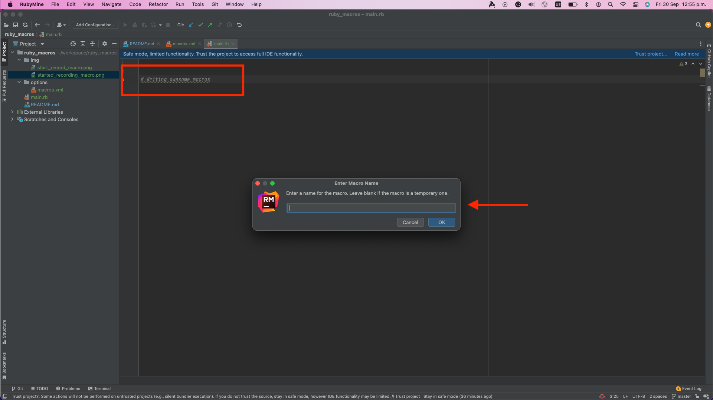

# ruby_macros
Project to setup macros using RubyMine. 

### Create RubyMine macros

1. First go to Edit -> Macros -> Start Macro Recording.
   
2. A message will be appear at bottom right.
   
3. Execute the actions.
4. Finally go to Edit -> Macros -> Stop Macro Recording.
5. Save the macro's name.
   

### Add RubyMine shortcut

1. Go to RubyMine -> Preferences -> Keymap -> Macros.
2. Right-Click -> Add Keyboard Shortcut.
3. Type the shoutcut that you want to use. 
4. Click to Apply and OK.
   

### Configuration directory
In order import or export macros to your RubyMine settings configuration:

#### MacOS

Syntax: 

`~/Library/Application Support/JetBrains/<product><version>`

Example: 

`~/Library/Application Support/JetBrains/RubyMine2022.3`

Open a terminal go to `RubyMine2022.3/options` folder: 

#### Linux
Syntax:

`~/.config/JetBrains/<product><version>`

Example:

`~/.config/JetBrains/RubyMine2022.3`

### References:
[RubyMine Macros](https://www.jetbrains.com/help/ruby/using-macros-in-the-editor.html)

[RubyMine Configuration directory](https://www.jetbrains.com/help/ruby/directories-used-by-the-ide-to-store-settings-caches-plugins-and-logs.html#config-directory)